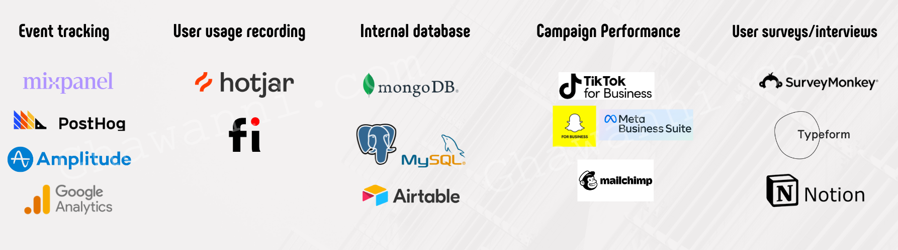

ادارة المنتجات مهنة صعبة،  لانك واحد من الاشخاص الذي يحدد بشكل أساسي ايش المشكلة  الازم حلها كفريق وسيشكل حلها نجاح الكبير. بالاضافة لذلك، واحدة من اصعب مهام مدير المنتجات هي انه ليس من يحدد المشاكل الضروري حلها فقط، بل لابد أيضا يحدد الأولوية. العملية هذه اصعب واعقد مما يتوقع الكثير.

في هذه السلسلة، سأحاول الإجابة على الكثير من الاسئلة التي تتعلق بادارة المنتجات؛ ولكن تمحور المقالات في هذه السلسلة سيكون عن الموضوع التالي بشكل أساسي:
> كمدير منتج، كيف أعرف ايش الموضوع اللي عملائي يبغوني أركز عليه وأحله بأسرع وقت؟ 🏃🏻‍♂️ 

والآن، خلينا ندخل فالموضوع...

- [مقدمة 👋🏻](#مقدمة-)
  - [ايش يسوي مدير المنتجات](#ايش-يسوي-مدير-المنتجات)
  - [تركيزنا في هذه السلسلة](#تركيزنا-في-هذه-السلسلة)
- [ايش المشاكل المهمة بالنسبة لمنتجي؟ 🤔](#ايش-المشاكل-المهمة-بالنسبة-لمنتجي-)
  - [وجود Roadmap ممكن تعتمد عليه](#وجود-roadmap-ممكن-تعتمد-عليه)
- [كيف أطلع بحلول ذكية؟ 🧠](#كيف-أطلع-بحلول-ذكية-)
  - [بناء الفرضيات](#بناء-الفرضيات)
- [ما يكفي الحل الذكي، لازم تلاقي الحل السريع كمان 🚀](#ما-يكفي-الحل-الذكي-لازم-تلاقي-الحل-السريع-كمان-)
  - [كيف نبني MVP سهل التطبيق؟](#كيف-نبني-mvp-سهل-التطبيق)
  - [الخطوات اللي تمر فيها الفكرة للوصول للحل النهائي](#الخطوات-اللي-تمر-فيها-الفكرة-للوصول-للحل-النهائي)
- [كيف أحدد الأولويات؟ 🔢](#كيف-أحدد-الأولويات-)
  - [بعض اطر العمل اللي ممكن تساعدك (RICE)](#بعض-اطر-العمل-اللي-ممكن-تساعدك-rice)
    - [مثال تطبيقي](#مثال-تطبيقي)
  - [كيف أربط دا كله في عملي اليومي؟](#كيف-أربط-دا-كله-في-عملي-اليومي)
- [تحميسة للجزء الثاني: بناء اختبارات بطلة 🔥](#تحميسة-للجزء-الثاني-بناء-اختبارات-بطلة-)

# مقدمة 👋🏻
الاجابة على السؤال السابق سيتطلب منا أن نستكشف أكثر من جانب في ادارة المنتجات. من معرفة المشاكل الموجودة في منتجنا، الى محاولة التفكير في حلول وتجريبها.

الرحلة ستكون مثيرة للاهتمام ومثرية؛ لو عندك اي تعليق، تصحيح، اقتراح، او تعمق اكثر في الموضوع، لا تتردد في انك تترك تعليق أو تتواصل معي، وسنعمل على التغيير اللازم حتى تكون هذه المقالة مرجع لاي مدير منتجات، مهندس برمجيات، مدير مشاريع، او مؤسس مهتم يتعمق اكثر في هذا المجال الرهيب.

والآن، وقبل ما ندخل في صلب الموضوع، خلينا نتفق على مسؤوليات مدير المنتجات.

## ايش يسوي مدير المنتجات؟
مدير المنتجات هو **المدير التنفيذي لمنتج**، وغالبا يكون هو افضل شخص يحدد كيف المنتج هذا سينجح، وما المشاكل التي يلزم علاجها حتى نصل لهذا النجاح.

قد تختلف المهام من سياسة كيان لآخر، ومن حجم فريق لآخر. ولكن، فالغالب اطار عمل مدير المنتجات قريب من القائمة ادناه:
1. دراسة الحلول المطروحة في السوق، وتحديد نقاط القوة والضعف فيها
3. بناء استراتيجية المنتج على المدى الطويل (سنين)
4. بناء خارطة الطريق (Roadmap) على مدى اقصر (ربع/نصف سنوي)
5. كتابة الخواص والميزات المراد بناءها في المنتج وتجربة المستخدم فيها بشكل Epics و User Stories
6. تحديد الأولويات في الخواص التي يبنيها الفريق وكيف يكون شكل الخاصية واستخدامها
7. بناء منتجات أولية (MVP) لاختبار فرضية معينة وأخذ قرار في بناء الخاصية من عدمه
8. تحليل البيانات الموجودة للمستخدمين، سواء بيانات تخص ملفات المستخدمين (Demographics) أو سلوكهم (Behavior) على المنتج

طبعا فيه بعض المسؤوليات فوق تكون على شخص آخر في الفريق بعض الاحيان (مثل محلل الأعمال) وفيه مسؤوليات اكثر قد لا تكون مذكورة هنا
ولكن بشكل عام لو كنا متفقين *(حتى لو بنسبة 70%)* في المهام أعلاه، حنكون في نفس الصورة في باقي السلسلة.

وبالحديث عن السلسلة، خلينا نشوف على ايش سيكون التركيز في باقي المقالات.

## تركيزنا في هذه السلسلة
في هذه السلسة حنغطي ونتعمق في جزء رئيس في مهنة ادارة المنتجات، واللي هو **بناء اختبارات للمنتج (Product experiments) صحية**، يشكل هذا الموضوع جزء ليس ببسيط من مهام أي مدير منتجات؛ وبناء معرفة كافية في هذا الموضوع يقدر يكون **فيرق في نجاح منتج من فشله في السباق مع الوقت للوصول الى الـproduct-market fit.**

سنتعمق مع بعض في أشياء كثيرة، قبل بناء الاختبارات وبعده؛ هذه قائمة مختصرة للأسئلة المراد الاجابة عليها في السلسلة:
* كيف أعرف المشاكل اللي موجودة في منتجي؟ 
* كيف أحدد الحلول وأشرحها بشكل جيد ومفهوم؟
* كيف أتأكد اني انا وفريقي في نفس الصفحة طوال الوقت؟
* كيف اقدر اقنع فريقي بالفرضية اللي طلعت بيها؟
* كيف ابني تجربه منتج جيدة ممكن اوصل بيها لاستنتاج صحي؟
* كيف أختار العينة من المستخدمين اللي حيجربوا حلولي الجديدة؟
* كيف أعرف متى أوقف الاختبار وابدأ ابني المنتج؟
* ايش فيه وسائل او قنوات ممكن تساعدني على توصيل اختباراتي؟
* *...وغيره الكثير*

السلسة دسمة وستكون باذن الله مفيدة.

أخذت وقتي في المقدمة، فخلينا ندخل فالموضوع! 🚀

# ايش المشاكل المهمة بالنسبة لمنتجي؟ 🤔
اجابتك لسؤال "إيش أحل" هو متطلب أولي عشان تبني منتجك. الجواب على هذا السؤال قد يكون رحلة (وسلسلة مقالات) بحد ذاته. ولكن الافتراض هنا هو اننا على معرفة بالمشكلة الاساسية التي نحاول نحلها بوجود Roadmap واضح.

## وجود خارطة طريق (Roadmap) ممكن تعتمد عليها
خارطة الطريق هذه ضرورية، وضروري يكون الفريق كله فاهمها وفاهم محتواها من الطقطق للسلام عليكم. وعشان ابغانا نكون فريق واحد في هذه السلسلة، حندخل مع بعض في Roadmap تخيلي في سكيلرز، وحأسوي لك Onboarding مختصر يساعدك تفهم اللي بنسويه؛ والسبب هو اننا نستطيع نبني على هذا الفهم المشترك بأمثلة تكون تحاكي الواقع.

في سكيلرز، منتجنا يسمح للشركات من **انشاء وظائف في مجالات معنية، منها المبيعات؛** والهدف هو استخدام بيانات الوظيفة ومحتواها للقيام **بمطابقة** بين المطلوب في **الوظيفة** وقاعدة **بيانات المرشحين** الموجودة لدى سكيلرز، مما يساعد على **ترشيح كفاءات** مناسبة للشاغر عند الشركة بشكل **سريع** (*بالتركيز على النقاط اللي بالخط الثخين*).

قاعدة بيانات المرشحين تتكون من مرشحين **سجلوا لدى سكيلرز واخذوا تقييم** تحديد مستوى في مجال المبيعات أو **خريجين معسكر سكيلرز للمبيعات**.

روعة، الآن عندنا تصور عام عن عمل المنتج؛ خلينا نعتبر ان عندنا أكثر من شي نحتاج تحسينه، ولكن أهم موضوع هو التالي:

📈 **زيادة عدد الترشيح (thumbs up) للكفاءات اللي يتم ترشيحهم للوظائف**. 📈

والآن، أتخيل كلنا عندنا نظرة عامة عن ايش الخدمة اللي يقدمها المنتج، وايش اهم شيء نحاول نحله في الفترة الحالية.

خلينا نشوف مع بعض كيف نقدر نطلع بحلول نقدر نطبقها سوية لحل هذا التحدي.

# كيف أطلع بحلول ذكية؟ 🧠
معرفة المشكلة هو نصف الحل، وبالنسبة لنا، المشكلة التي نحاول حلها هي **زيادة نسبة الترشيح**.

أول سؤال لازم نسأله نفسنا هو: **احنا فين الآن؟**

وبعد ما شفنا قاعدة البيانات الداخلية وجدنا ان **معدل الترشيح** من جميع المرشحين الموجودين على المنصة هو **%41.**

روعة، جاوبنا أول سؤال.
والآن،  أحتاج أفكر بحلول كثيرة تساعدني على تحسين هذا الرقم، وهذا يمكن القيام به عن طريق عصف ذهني او Brainstorming مع الفريق، المستخدمين، أو حتى ChatGPT.

وغير الحلول اللي تحسن الرقم، أحتاج يكون عندي **تصور عن مدى تحسّن الرقم (التأثير)** نتيجة لكل حل مقترح؛ ومن تجربتي (*المحدودة*) أفضل الطرق اللي ممكن تساعدك على تحديد التأثير:
* أقرب سلوك ممكن تسقطه على هذا السلوك (مثلا: عدد ملفات المرشحين التي عرضت من قبل الشركات) - Proxy
* البحث عن شركة تقدم حل مشابه، وتقيّم لو عندهم أي منشورات عن هذا السلوك (أو ما يشابهه) -  Benchmark
* عمل مقابلات مع بعض المستخدمين للنظام وتسألهم عن تجربتهم - User interviews
* قراءة بحث منشور أو تقرير (حتى لو من منطقة ثانية فالعالم او وقت قديم) وتستخدمه كنقطة بداية للمقارنة - Research

وفي الصورة أدناه، حبيت أضيف بعض المصادر اللي أستخدمها شخصيا لما أحاول أدور أرقام ممكن أستخدمها أثناء بحثي:
.png)

خلينا نفترض اننا قمنا بعمل دراسة مقارنة للحلول مع شبكة توظيف ثانية (*ZipRecruiter*) ووجدنا ان لديهم معدل الترشيح للكفاءات المقترحة في 2017 كان **54%.**

هذا يعطينا تصور جيّد عن مدى التحسين الممكن الوصول له بحلول بسيطة بحكم ان هذا الرقم كان ممكن الوصول له بالتقنيات المتوفرة من سنين. 🙌🏻

وبعد ما اجتمعنا مع الفريق وقابلنا بعض المستخدمين، استطعنا أن نخرج بأكثر من حل ممكن يساعدنا على زيادة الترشيحات. منها السهل تطبيقه، ومنها الأكثر تعقيدا. والآن، نستعرض بعض الحلول اللي طلعنا فيها ونختار واحد منها حتى نكمل معاه الرحلة كاملة:
1. نزيد صعوبة اختبار دخول قاعدة بيانات سكيلرز، بحيث ان جودة المرشحين تكون أعلى
2. نقترح كفاءات من خارج قاعدة البيانات الحالية للوظائف في سكيلرز في حال كانوا مطابقين لاشتراطات الوظيفة (حتى ولو ما سجلوا واختبروا بنفسهم)
3. إرسال إشعارات يومية للمستخدمين في حال عدم دخولهم للمنصة ورؤية قائمة الترشيح المضافة للوظيفة
4. تحسين الطريقة التي يتصفح خلالها المستخدم الكفاءات المرشحة للوظيفة
   
والآن، عندنا اكثر من حل وكل واحد منهم **يفترض ان المشكلة سببه مختلف.** فالجدول أدناه، حنراجع كل حل والسبب اللي يفترض انه أكبر مشكلة وبعض البيانات الاضافية التي من خلالها نقرر أخذ أو ترك الحل ونتعمق فيه أكثر:

| الحل                                                                                                                                    | المشكلة المتوقعة                                                                         | بيانات/اسئلة إضافية مطلوبة                                         | أجوبة                                                                                                                                            |
| --------------------------------------------------------------------------------------------------------------------------------------- | ---------------------------------------------------------------------------------------- | ------------------------------------------------------------------ | ------------------------------------------------------------------------------------------------------------------------------------------------ |
| نزيد صعوبة اختبار دخول قاعدة بيانات سكيلرز، بحيث ان جودة المرشحين تكون أعلى                                                             | جودة المرشحين غير مرضية                                                                  | هل يُرفض الكثير من المرشحين عند الوصول للمقابلة الوظيفية؟          | لا، وجدنا ان 15% من المرشحين اللي يوصلوا للمقابلة يتم رفضهم و 85% يوصلوا لمرحلة ارسال العرض                                                      |
| نقترح كفاءات من خارج قاعدة البيانات الحالية للوظائف في سكيلرز في حال كانوا مطابقين لاشتراطات الوظيفة (حتى ولو ما سجلوا واختبروا بنفسهم) | **عدد المرشحين في المنصة غير كافي**                                                      | هل عدد المرشحين في الوظائف كافي؟                                   | **لا**، 67% من الوظائف فيها اقل من 3 مرشحين بسبب أن الوظيفة لسيت وظيفة تقليدية وممكن أن نطابق المرشحين لها بشكل سهل؛ أو الوظيفة لها متطلبات خاصة |
| إرسال إشعارات يومية للمستخدمين في حال عدم دخولهم للمنصة ورؤية قائمة الترشيح المضافة للوظيفة                                             | الشركات لم يروا المرشحين، مما ينتج في انهم لا يزودوا الترشيحات المعطاه تغذية راجعة       | هل أغلبية المرشحين لم يصلهم عليهم ردود؟                            | لقينا ان 32% من المرشحين ما عليهم ردود، وشركاء التوظيف ما دخلوا المنصة بعد انشاء الوظيفة                                                         |
| تحسين الطريقة التي يتصفح خلالها المستخدم الكفاءات المرشحة للوظيفة                                                                       | تجربة المستخدم سيئة، مما يؤدي إلى أن المستخدم يخرج من قبل أن يعطي رأيه على جميع المرشحين | هل عندنا الكثير من المستخدمين اعطوا رأي على *جزء* من المرشحين فقط؟ | لا، 12% من المستخدمين اعطى رأي على مرشح من غير ما يكمل القائمة كاملة                                                                             |

> ⚠️ **الأرقام تخيّلية 100%،** الهدف تعليمي فقط. لكن حاولت انها تكون مقاربة للواقع بأكبر شكل ممكن. :) ⚠️

نقدر نشوف ان بعد بعض التحري، عرفنا ان الحلين الممكن تطبيقهم ويؤدوا الى نتائج جيدة هم **الحل رقم (2)** و**الحل رقم (3)**. والآن، خلينا نبني فرضيات تساعدنا على تجربة بعض الحلول اللي ممكن تساعدنا في ايجاد أدلة مبدئية لكل حل.

في بقية السلسلة، **حأكمل بالحل رقم (2) فقط،** عشان يكون طول المقالة مقبول وسهل القراءة.

الهدف هنا كان تسليط الضوء على ان من الممكن جدا انك **تجد اكثر من حل قد يكون فعّال**. بالاضافة على **احتمالية ثبوت عدم فاعلية بعض الحلول بمجرد النظر الى بيانات أكثر** تثبت أو تنفي الحل بشكل سريع قد يختصر عليك الكثير من الوقت.

## بناء الفرضيات
بناء الفرضيات يعتبر خطوة حاسمة في عملية حل المشاكل وتحديد أفضل مسار للتحسين. الفرضية تسمح لك بتحديد ما تتوقع حدوثه عند إجراء تغيير معين، وتقديم تفسير واضح للأسباب وراء هذه التوقعات. عشان نضمن تجربة ناجحة، نحتاج نبني فرضيات قوية وواضحة تكون مبنية على البيانات المتاحة والفهم العميق للسلوكيات المحتملة.

الإطار اللي نقدر نعتمده لصياغة الفرضية هو التالي:

- **If [action/change]** - الإجراء أو التغيير المقترح.
- **Then [expected outcome]** - النتيجة المتوقعة بعد تنفيذ الإجراء.
- **Because [rationale/underlying assumption]** - السبب أو الافتراض الأساسي وراء توقع هذه النتيجة.

خلينا نأخذ الحل اللي اخترناه "*نجيب كفاءات من خارج قاعدة البيانات الحالية*" ونبني فرضية توضح كيف ممكن هذا الحل يساعد في تحسين النتائج.

**لو** نسمح للشركات بمطابقة مرشحين من خارج قاعدة البيانات،

**الناتج حيكون** زيادة في عدد الترشيحات (thumbs up) بنسبة  10%،

**بسبب أن** العديد من الوظائف تتطلب مهارات خاصة، وحاليا قاعدة بيانات المرشحين لا تغطي جميع المهارات المطلوبة، مما يجعل بعض الوظائف لا تحصل على ترشيحات كافية.

في هذه الفرضية، نحدد الإجراء اللي حنقوم به بوضوح، وهو إضافة مرشحين من خارج قاعدة البيانات. النتيجة المتوقعة هنا هي زيادة في عدد الترشيحات بنسبة 10%، وهي نسبة نقدر نتابعها بشكل مباشر بعد تنفيذ الحل. أما السبب فهو الإفتراض أن النقص الحالي في الترشيحات يعود إلى عدم توفر مرشحين بشكل كافي بمهارات مطابقة لبعض الوظائف، مما يجعلنا نعتقد أن الحل سيؤدي إلى النتيجة المرجوة.

أخترنا 10% لأننا على معرفة بوجود فرصة تحسّن على الأقل بنسبة 13% استشهادًا بالبحث السابق على ZipRecruiter.

الفرضية الجيدة تسهل علينا التركيز على البيانات والمقاييس اللي نحتاج نتابعها. وبدونها، من السهل نضيع في تجارب ما لها نتائج واضحة أو منطقية.

# ما يكفي الحل الذكي، لازم تلاقي الحل السريع كمان 🚀
بناء الحلول الذكية هو أساس لأي تقدم حقيقي، لكن إذا الحل الذكي يأخذ وقت طويل لتطبيقه، ممكن ما تستفيد من نتائجه في الوقت المناسب. هنا يدخل دور الحل السريع، واللي يركز على تقديم قيمة للعميل بأسرع وقت ممكن مع استمرار تحسين المنتج بناءً على هذه الفرضية.

## كيف نبني MVP سهل التطبيق؟
واحدة من أهم الطرق اللي تساعدك على إيصال الحل للعميل بسرعة هي تجربة الفكرة بأبسط طريقة ممكنة. كمدير منتج، من المهم يكون عندك القدرة على التفريق بين الحلول الكبيرة اللي تحتاج تخطيط طويل، وبين الحلول اللي ممكن تنفذها بشكل سريع وتشوف نتيجتها مباشرة. وهنا يدخل مفهوم الـ MVP (Minimum Viable Product)، وهو أبسط نسخة من المنتج أو الحل اللي تقدر تبنيها وتقدم من خلالها قيمة مبدئية لعملاءك.

الفكرة الرئيسية في بناء الـMVP هي **التحقق من صحة الفرضية** بأقل تكلفة وجهد ممكن. نستطيع نستخدم الحل السابق: "نجيب كفاءات من خارج قاعدة البيانات الحالية" كمثال لإكمال الفكرة.

## الخطوات اللي تمر فيها الفكرة للوصول للحل النهائي
هذه خطوات حتساعدنا نرتب افكارنا للوصول للـMVP للفرضية الموجودة معانا:

   * **التحديد الواضح للفرضية**: مثل ما سوينا في قسم "بناء الفرضيات"، لازم تكون الفرضية واضحة وتعتمد على بيانات متوفرة أو منطق قابل للتجربة.
   

فرضيتنا هنا:
إذا جبنا **مرشحين إضافيين من خارج قاعدة البيانات،** نقدر نزيد عدد الكفاءات المطابقة للوظائف.
لأن هناك وظائف بشروط محددة جدا والتي تجعل عدد الكفاءات المتاحة في قاعدة بيانات سكيلرز الحالية قليل.

* **بناء الـMVP**: عشان نختبر فرضيتنا، ما نحتاج نبني نظام معقد او خاصية بكل تفاصيلها تجيب المرشحين من مصادر خارجية. ممكن نبدأ بحل سريع عن طريق:
  - جمع بيانات عن مرشحين من مصادر خارجية (مواقع توظيف أخرى مثلا).
  - ربط هذه البيانات مع النظام الحالي يدويًا أو بإستخدام أدوات جاهزة وبسيطة.
  - عرض هذه البيانات بجانب المرشحين الموجودين في قاعدة البيانات الداخلية، وتحديد الشركات التي توافق على إضافة مرشحين من الخارج.

مثلا، نقدر نبني Gallery view في Airtable ونرسلها كـ"قائمة اضافية" للشركات، ونشوف كيف يتفاعلوا معاها. أو لو نقدر، يختار فريقنا مرشحين من مواقع خارجية، ويدخلهم بشكل يدوي على قاعدة البيانات. مما يسمح من استخدامهم كمرشحين عاديين.

* **قياس النتائج**: بعد تطبيق الـMVP، نحتاج نراقب النتائج ونتأكد من أن الحل فعلاً بيزيد من الترشيحات. لو كانت النتائج إيجابية، نقدر نبدأ في بناء حل دائم وأكثر تعقيدًا.

لو كنت تتساءل: "طيب من فين تجيب البيانات هذه؟"، الجواب هو انها جزء لا يتجزأ من بناءك للـMVP. الهدف الرئيسي من الـMVP هو جمع البيانات عشان تقدر تاخذ قرار سليم مبني على أرقام بخصوص التعمق في الحل أو البحث عن بديل. لذلك، ضروري جدا انك تكون متأكد ان الأداة اللي تستخدمها لبناء الـMVP تسمح لك بجمع البيانات بشكل سهل وتحليلها.

الصورة التالية فيها بعض الأدوات اللي ممكن تفكر في استخدامها عشان تقدر تجمع وتدرس سلوك المستخدمين وتجاوبهم مع حلك السريع.

* **تحسين الحل**: بناءً على ردود الفعل والبيانات، نقدر نطور النظام ونزيد من كفاءته. ممكن نحول العملية اليدوية إلى أوتوماتيكية، أو نوسع نطاق جلب المرشحين ليشمل مواقع توظيف أكثر.

فالغالب، ما يحتاج تؤتمت أي شيء لا يستنفذ وقت كبير من الفريق. خصوصا لو كان بناء هذه الخاصية بطيء وممكن تتغير تفاصيله. خصوصا لو كانت توجد تفاصيل لا يمكن أن نحددها إلا من خلال التجربة اليدوية لفترة مؤقتة.

# كيف أحدد الأولويات؟ 🔢
تحديد الأولويات من أصعب وأهم القرارات اللي يأخذها مدير المنتج بشكل دوري.

ولو ما عرفت تحدد إيش المشكلة اللي تستحق إنك تركز عليها أولاً، فكل جهودك وحلولك ستكون مشتتة في اتجاهات كثيرة بدون فائدة واضحة.

تقدر تستخدم بعض الأُطر (frameworks) لتحديد الأولويات بناءً على معايير واضحة تساعدك على إتخاذ القرار بطريقة عقلانية ومنطقية. وبعد فترة، غيّر الطريقة المتبعة تدريجيًا حتى تناسب احتياجك وتمكنك في التنبؤ بالأولوية والوقت المطلوب بشكل أدق.

## بعض اطر العمل اللي ممكن تساعدك (RICE)
يوجد أكثر من إطار عمل ممكن تعتمد عليه لتحديد الأولويات بناءً على عوامل مختلفة. واحد من الأطر الفعالة هو RICE framework. هذا الإطار يعتبر من أفضل الأدوات اللي تستخدمها لتحديد أولويات المهام أو الميزات اللي تحتاج بناءها في المنتج.

الإطار يعتمد على أربعة معايير رئيسية:

* **Reach (الوصول):** كم عدد الأشخاص اللي حيستفيدوا من الميزة أو الحل اللي حتقدمه؟
* **Impact (الأثر):** كم هو الأثر المحتمل للحل أو الميزة على المستخدمين؟ هل حيكون تأثيره كبير جدًا أم بسيط؟
* **Confidence (الثقة):** إلى أي مدى أنت واثق من أن هذا الحل حيعطي النتائج اللي تتوقعها؟ هذا العامل يساعدك على تقييم مدى اعتمادك على البيانات والمعلومات المتاحة.
* **Effort (الجهد):** كم من الوقت والموارد تحتاج عشان تطبق الحل أو الميزة؟ هذا العامل ضروري لتقييم الموارد اللي عندك والتأكد إنك تقدر تنجز المهمة بدون تضييع وقت أو مجهود كبيرين.

ونقدر نحسب الناتج النهائي بتطبيق المعادلة التالية:

### مثال تطبيقي
خلينا ناخذ بعض الحلول اللي طرحناها قبل ونجرب نستخدم RICE لتحديد الأولويات.

| الحل                          | Reach (مستخدم) | Impact | Confidence | Effort  | النتيجة النهائية |
| ----------------------------- | -------------- | ------ | ---------- | ------- | ---------------- |
| تحسين تصفح الكفاءات           | 50             | 5      | 20%        | 10 أيام | 5                |
| إشعارات يومية للشركات         | 15             | 2      | 80%        | 2 أيام  | 12               |
| كفاءات من خارج قاعدة البيانات | 20             | 5      | 100%       | 2 أيام  | 50               |

بناءً على الحسابات، نقدر نشوف أن الحل الخاص بجلب كفاءات من خارج قاعدة البيانات هو الحل اللي حيقدم أكبر أثر بأقل جهد، ويستحق أن يكون الأول في الأولويات.

## كيف أربط هذا كله في عملي اليومي؟

تحديد الأولويات بناءً على أطر عمل مشابهة RICE ما يعني إن كل شيء ينتهي هنا. الفكرة هي إنك تخلق نظام يدعم عملية اتخاذ القرار بشكل مستمر، وتقدر تراجع الأولويات مع الفريق بشكل دوري. لو حققت هذا الهدف بشكل منظم ومرتب، تقدر تضمن تحركك بشكل أسرع وتحقيق النتائج اللي تبغاها مع فريقك.

تقدر تبدأ يومك باجتماع قصير مع الفريق تراجع فيه الأهداف والأولويات (أو خليه رسالة مؤتمتة عشان تقلل اجتماعات)، وتتابع التحديثات اللي حصلت. وبكدا تقلل التشتيت وتضمن إن الكل فاهم إيش الأولوية وإيش يحتاج يحل اليوم. وممكن تخلي هذا جزء من الـstand-up.

# تحميس للجزء الثاني: بناء اختبارات بطلة 🔥
في هذه المقالة، أستعرضت الأساسيات لإدارة المنتجات وكيفية التعرف على المشاكل اللي يحتاج المنتج لحلها.

تطرقنا لأهمية وجود خارطة طريق (Roadmap) واضحة، وكيفية التفكير في حلول ذكية وفعّالة، بالإضافة إلى بناء الفرضيات واختبارها لتحقيق أفضل النتائج. شفنا كمان كيف الأولويات تلعب دور كبير في تحديد الخطوات اللي لازم نركز عليها لبناء منتج ناجح.

الـRoadmap بحد ذاتها موضوع جدا وخياخد اللي يستحقه من عمق في سلسلة مقالات قادمة ان شاء الله.

**لكن رحلة بناء اختبارات المنتجات ما تنتهي هنا!**

في المقالة القادمة، حنروح أعمق في كيفية تصميم وبناء اختبارات فعّالة على المنتجات، وحنتعلم كيف نطبق أساليب علمية ومنهجيات يمكن تكرارها لضمان جودة التجربة والحصول على نتائج دقيقة تساعدنا على تحسين المنتج بشكل متواصل.

لو كنت مهتم بفهم الجانب العملي لبناء اختبارات منتج قوية، وتود إنك تتعلم كيف تاخذ قرارات تعتمد على البيانات، فأنت في المكان الصحيح.

المقالة القادمة ستكون دليلك لتطوير تجارب مبتكرة تساعد في تحقيق النجاح بشكل منهجي ومستدام.

ولو عندك أي ملاحظة، مشاركة، أو تعديل، **لا تتردد** في أن تتواصل معي، لأن بهذه الملاحظات أتحسن، ونقدر نخلق محتوى عربي يستاهله التقنيين في مجالنا الجميل.

---

*شكر خاص لزميلي وصديقي الخرافي [عبدالرحمن الدعيج](https://www.linkedin.com/in/abdulrahmanald-j/) لقراءة المسودات من هذه السلسلة ومساعدتي على تحسينها*

> سأكون ممتن لو ساعدتني على نشر العمل هذا عن طريق إرسال المدونة لأحد ممكن يستفيد منها. فالأخير الهدف هو نشر محتوى عربي تقني بجودة عالية مجانًا؛ مساعدتك لي في هذا الهدف يعني لي الكثير. 🐳🍉
> 
> //غوني